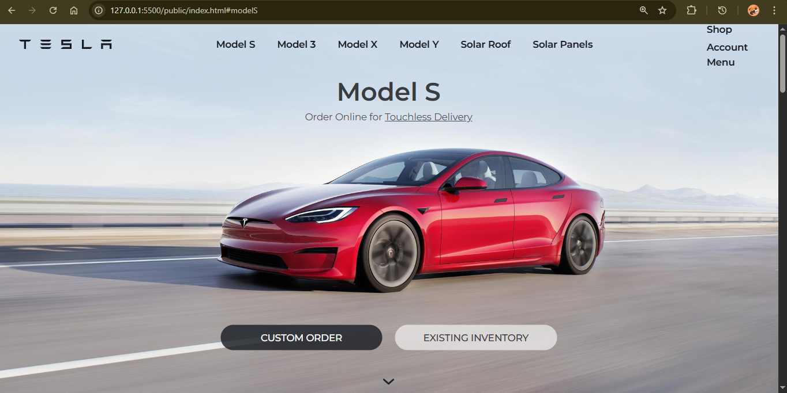
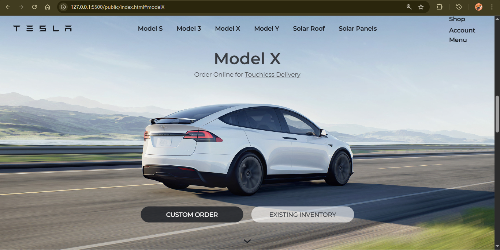
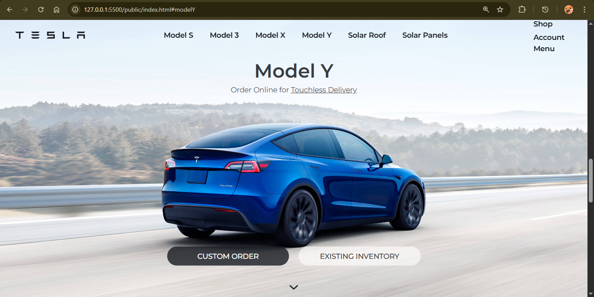
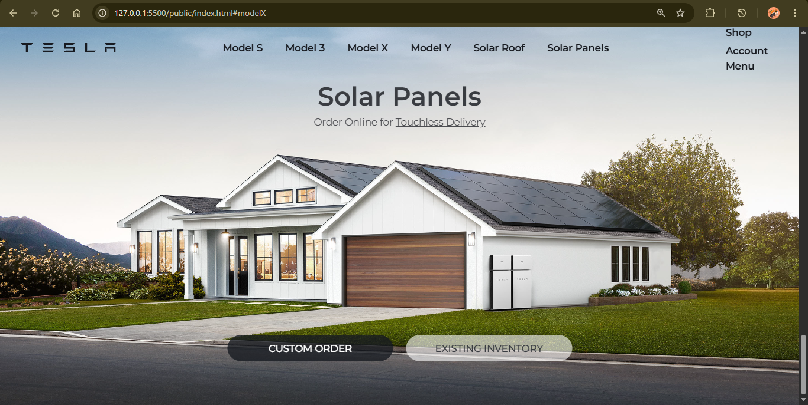

# 🚗 Tesla Landing Page Clone

A sleek, responsive clone of the Tesla homepage showcasing electric vehicles and clean energy products. Built using HTML5 and Tailwind CSS, this project replicates the modern UI design and section-based layout of Tesla’s official site.

---
# Live Demo
[click here](https://tesla-landing-page-clone-phi.vercel.app/)
## 📌 Features

-**🚘 Smooth-scrolling sections for Tesla models: Model S, 3, X, Y**

-**☀️ Solar product sections: Solar Roof & Solar Panels**

-**🧭 Fixed navigation bar with internal anchor links**

-**💻 Fully responsive design using Tailwind CSS**

-**📷 Image-rich UI for better product visualization**

-**🧭 Scroll navigation with down arrows between sections**

---

## 🛠️ Tech Stack

-**HTML5**
-**Tailwind CSS**
-**Google Fonts**

---

## 🖼️ Folder Structure
```bash
tesla-clone/
│
├── index.html                # Main HTML file
├── tailwind.css              # Tailwind CSS stylesheet
└── images/
    ├── favicon.ico
    ├── tesla.svg
    ├── ModelS.jfif
    ├── Model3.jfif
    ├── ModelX.jfif
    ├── ModelY.jfif
    ├── SolarRoof.jfif
    └── SolarPanels.jfif
```

---

## 🚀 How to Run

### 1. Clone the repository

```bash
https://github.com/KavanaBC/Tesla-Landing-Page-Clone.git
```

### 2. Open in browser

```bash
Simply open index.html in your preferred browser.
```
---

## Screenshots

#### 🖼️ Model S


#### 🖼️ Model X


#### 🖼️ Model Y


#### 🖼️ Solar Panels


---

## 📖 Learnings

-**Responsive layout with Tailwind CSS**

-**DOM structure planning using semantic HTML**

-**Navigation with internal anchor links**

-**Optimizing images and assets for web**

---

## Author

KAVANA B C

---
